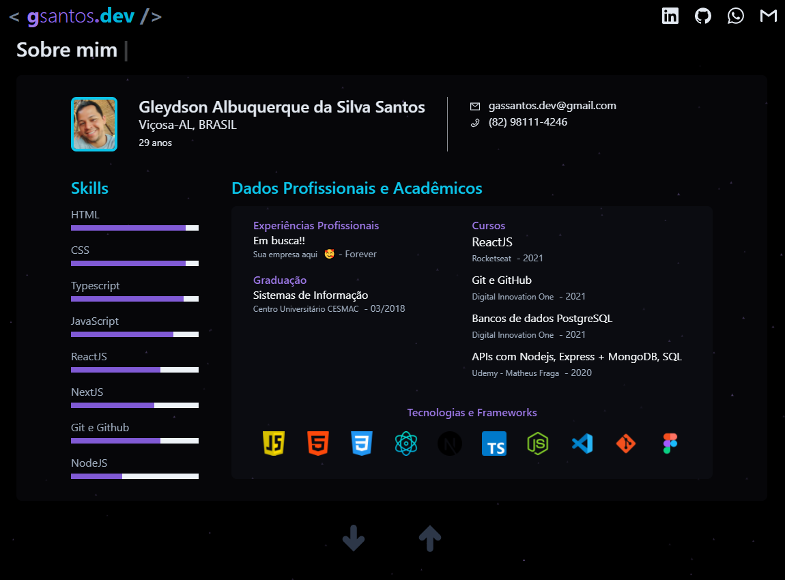

## 💻 Portfólio

Este projeto tem por finalidade ser meu cartão de visitas, fornecendo informações como dados profissionais e projetos executados. 

<h2>🖥️ Home </h2>

  

<h2>🖥️ About: </h2>

  

## ✨ Tecnologias

Esse projeto foi desenvolvido com as seguintes tecnologias:

- [ReactJS](https://reactjs.org)
- [TypeScript](https://www.typescriptlang.org/)
- [Chakra UI](https://chakra-ui.com/)
- [Firebase](https://firebase.google.com/)
- Bibliotecas de estilização
  - [Animate.css](https://github.com/animate-css/animate.css?files=1)
  - [React Responsive Carousel](https://github.com/leandrowd/react-responsive-carousel)
  - [tsParticles](https://github.com/matteobruni/tsparticles)

## 🚀 Aplicação disponível online

Você pode visitar esta página através [desse link](https://gsantos.dev.br/).

## 🚀 Como executar

- Clone o repositório
- Instale o [Node.js](https://nodejs.org/en/download/)
- Instale o [Yarn](https://classic.yarnpkg.com/en/docs/install/#windows-stable)
- Inicie o servidor com `yarn start` no terminal

Agora você pode acessar [`localhost:3000`](http://localhost:3000) no seu navegador.

---

Fique à vontade para baixar o projeto, porém, não faça uma cópia exata aplique sua personalidade! Deixa uma ⭐ se gostou.

Me encontre [aqui](https://www.linkedin.com/in/gleydson07/).
